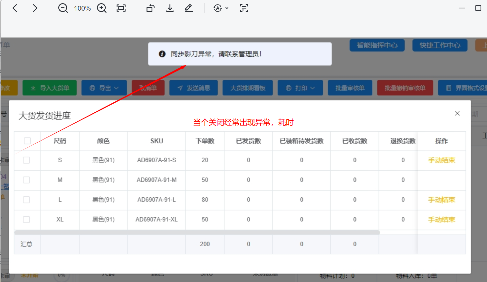
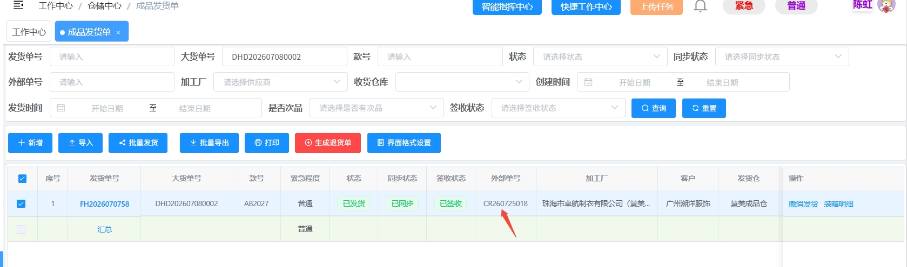
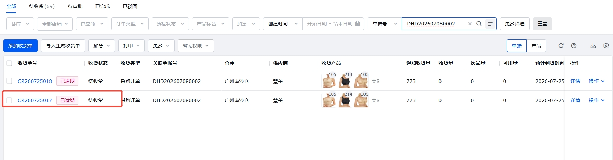
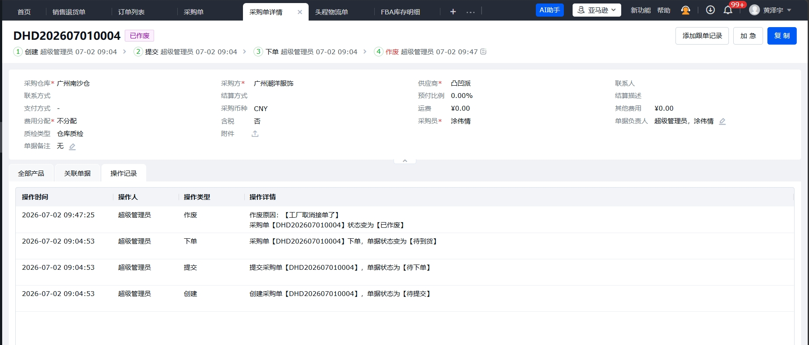
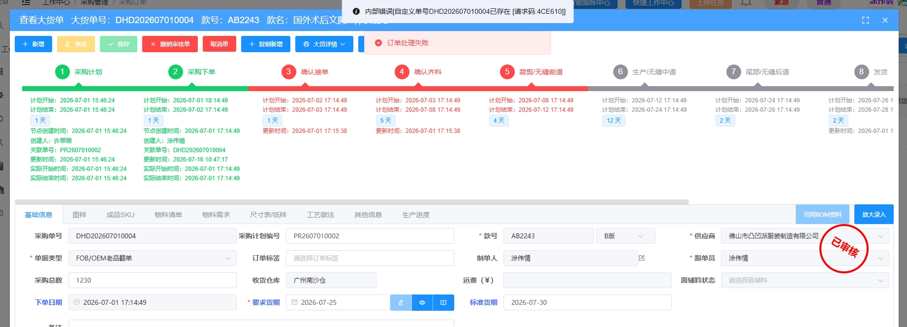
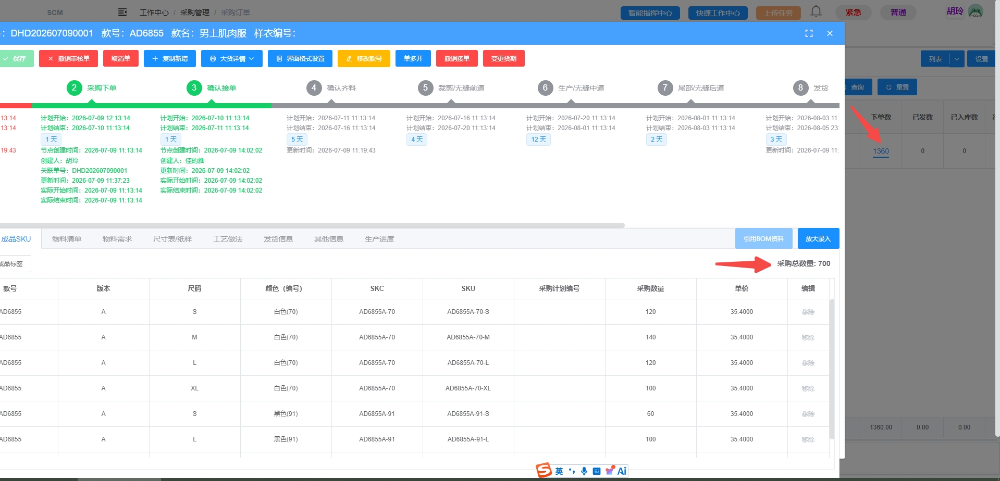

# SCM系统新增需求,及优化需求

**订单跟进流程**

**1\.1 每周下单（日常订单）**

每周由PMC在飞书群同步下单计划，采购人员按以下 6 个步骤完成下单：

|**编号**|**流程步骤**|**操作说明**|**参考路径 / 数据来源**|**系统/AI 优化建议**|
|---|---|---|---|---|
|A1|获取下单文档|采购跟进供应商产能结合绩效成本分配给个供应商同步到采购群|采购生产业务群 [采购订单20260813\.xlsx](图片和附件/采购订单20260813.xlsx) |数据打通，系统自动核算供应商管理绩效，自动分配采购订单|
|A2|检查工厂库存|在采购部文档中查找对应工厂库存表，使用公式匹配库存数据；如有库存，比对是否存在最新版本：若已下过最新版本则不下旧版，否则优先下单库存 SKU|[库存汇总20260528\.xlsx](https://v0xsosgslg1.feishu.cn/wiki/AsY7wpFQHiVLfbkuyJ5cKwJHn1f)  供应商库存表|\[数据打通\] 库存统一进 SCM 并自动校验版本；AI 比对最新版本，提示优先下库存 SKU|
|A3|检查下单版本|在采购部文档中查找 2025 年版改进度优化表，匹配最新版本 SKU 下单|采购部线下文档\-修改\-产品目录表\-最新22102211 [产品目录表\-最新22102011\.xlsx](图片和附件/产品目录表-最新22102011.xlsx) |\[数据打通\] 产品目录做成主数据\(MDM\)，下单时系统自动带出最新版本 SKU，杜绝旧版误下|
|A4|检查胶袋使用情况|在采购部文档中查找使用通用版真空袋二合一的款号表，匹配需使用真空袋的款式，填入下单备注|[二合一包装测算（热销品包装优化项目\&新品测算汇总版）](https://v0xsosgslg1.feishu.cn/sheets/POnDspUvhhq7BYtBvPHcGg8pn5g?sheet=0BSjuP)  |款号\-包装规则维护进系统，下单时自动带出胶袋备注，取消人工查询 |
|A5|订单下推、订单发给工厂|完成上述三项核对后，将订单信息录入采购部文档「当天下推表」，填写跟单、下推 SKU、供应商、胶袋使用备注；完成后可将该数据提前发送对应工厂安排调料|采购部文档\-采购订单下推 [采购订单下推20260729\-下推\.xlsx](图片和附件/采购订单下推20260729-下推.xlsx) | |
|A6|订单导入系统，通知工厂接单|在 SCM 系统「采购订单\-导入采购单」下载导入模板，将下单信息按模板填写至大货单导入模板并上传|SCM系统\-采购订单\-导入采购单\-下载导入模版||

**2\.1、 订单追踪**

下单后持续追踪工厂执行进度，共 4 个环节：

|**编号**|**流程步骤**|**操作说明**|**参考路径 / 数据来源**|**系统/AI 优化建议**|
|---|---|---|---|---|
|B1|核对工厂面辅料到料情况|下单后查看工厂是否在对应面辅料群发起调料；调料后在群内查看面辅料供应商回复的发料日期及成衣工厂实际签收日期|工厂面辅料群\-面辅料申请表|系统根据成品订单和BOM自动计算面辅料需求，生成采购计划并下发给面辅料供应商。可同步查询进度|
|B2|面辅料到齐后跟进工厂裁剪、车缝、尾部工序|每日跟进并将订单最新进度填写至订单管理表格；到料后进度参照：裁剪 1\-2 天、车缝 8\-10 天、尾部 2\-3 天|采购生产业务群\-订单管理|通过MES扫菲系统，可了解每个生产进度，自动预警催单 |
|B3|整理未交给工厂|供应商发货后，在领星 ERP「采购单\-待到货」中选择对应工厂，下载在途订单交工厂核对进度|领星ERP\-采购单\-待到货\-筛选供应商\-下载|系统供应商自动导出待出货，待入库|
|B4|核对工厂货期并更新到在线表|工厂回复货期后，核对货期是否在准交期限内；如逾期，与工厂再次确认是否为紧急订单及可否提前；核对后更新至采购部生产业务沟通群\-订单管理|紧急订单：采购部文档\-A优先回货明细\-找到最新日期的那份查询|交期承诺系统化，自动计算准交率；逾期预警 \+ 紧急订单自动关联|

**2\.2 新款订单（开发到入库全流程）（转厂款优化款流程类似）**

新款订单覆盖自 PR 下发生至质检入库的完整生命周期，共 14 个阶段，整体流程如下：

|**① 下 PR** PMC 下发采购申请|
|---|

▼

|**② 跟进调版料 → ③ 跟进复版进度** 封样/制单/纸样同步工厂 → 复版送审（通过做跳码版 / 不通过重做送审）|
|---|

▼

|**④ 系统下 PO → ⑤ 跟进大货面辅料齐料** SCM 生成大货单并发工厂 → 材料部跟进到料完成|
|---|

▼

|**⑥ 齐码版 \+ 物料卡制作与审批** 技术部审跳码版 → 材料部审物料卡 → 盖章版寄仓库/留底/退工厂|
|---|

▼

|**⑦ 召开产前会议** 技术、品控、采购、工厂四方参与，明确工艺与质量要求|
|---|

▼

|**⑧ 首扎验收 → ⑨ 提供拍照版** QC 出具《首扎检验报告》→ 提供女 S/M、男 L 拍照版并登记|
|---|

▼

|**⑩ 中期查货 → ⑪ 尾期查货** QC 出具《中期检验报告》《尾期检验报告》，通过出货 / 不通过返修|
|---|

▼

|**⑫ 工厂发货 → ⑬ 到货 → ⑭ 质检入库** 预约送货 \+ SCM 发货单 \+ 通知收货 → 审批“商品信息对接” → 品控质检，通过入库 / 不通过退货|
|---|

**阶段明细**

|**编号**|**流程节点**|**操作说明**|**参考路径 / 数据来源**|**系统/AI 优化建议**|
|---|---|---|---|---|
|C1|下 PR|PMC 下发 PR|SCM系统\-采购计划列表\-输入款号查询||
|C2|跟进调版料，安排工厂复版|将封样寄送工厂，制单、纸样同步至工厂；由材料部安排打版面辅料，并跟进版料到料情况|材料部对接人：面料\-雷月明，辅料\-冯秋妹||
|C3|跟进复版进度|跟进工厂复版进度，收到复版及封样后，在飞书\-齐码版批复沟通群\-在线文档\-26年前产前样登记表登记，并交接技术部何锦仪。 通过：审版报告发送工厂；有优化意见的，同步工厂按审版报告优化后制作跳码版； 不通过：审版报告同步工厂，按审版意见修改后重新送审|报告来源：飞书\-齐码版批复沟通群\-审版报告| 系统跟进样板进度及审批记录|
|C4|系统下 PO|在 SCM\-采购计划列表输入款号查询，点击生成大货单，选择供应商及单据类型，点击获取要求货期，保存并审核单据；随后在 SCM\-采购管理\-采购订单输入款号查询，导出大货单明细（多单合并）发送工厂|SCM\-采购计划\-采购计划列表\-生成大货单|一键生成大货单（预填供应商/货期），导出明细自动推送工厂， |
|C5|跟进大货面辅料齐料|与材料部确认大货面辅料到料时间，跟进至到料完成|面料：雷月明，辅料：冯秋妹| |
|C6|齐码版 \+ 物料卡制作与审批|跳码版提交技术部何锦仪审核： 审核通过：出具盖章版两件——1 件寄仓库（罗菊英收\-温嫂 13660782895，广东省广州市南沙区榄核镇榄核大道107号，东泰科技园盛鸿云仓（原址细刻）），1 件退回工厂核对大货； 审核不通过：退回工厂重做。 物料卡一式三份，收到后提交材料部匡磊审核： 审核通过：一份寄仓库温嫂、一份采购留底、一份退回工厂； 不通过：寄送仓库的物料需填写在线表格后寄往仓库，并重新提供合格物料送审|飞书\-采购业务生产沟通群\-部门用表在线链接集合\-\-南沙仓样衣库位汇总表\-登记|— |
|C7|召开产前会议|跳码版审核通过后召开产前会，参与人员为技术、品控、采购及工厂；会议明确工艺、质量等要求，输出产前会记录。由采购安排时间预订会议室，拉通内部人员参与，并提前约好 QC 赴工厂现场参与|工厂参与：车间技术负责人；车间师傅通过视频参与||
|C8|首扎通知 QC 验收|工厂开始生产后，采购同步安排 QC 查验首扎并出具《首扎检验报告》： 通过：继续生产；不通过：按检验报告改善后恢复生产|首扎报告来源：QC 输出在企业微信\-潮洋与供应商成品对接群||
|C9|提供拍照版|女款 S/M 码各色一件、男款 L 码一件；提供后需在拍照版登记表（20250101 起，最新）登记|采购部文档\-修改\-拍照版及每周送货计划\-拍照版登记20250101起（最新）||
|C10|生产中期 QC 查货|生产中期通知 QC 查验并出具《中期检验报告》： 通过：继续生产；不通过：按检验报告改善后恢复生产|中期报告来源：QC 输出在企业微信\-潮洋与供应商成品对接群||
|C11|尾期通知 QC 查货|确认出货日期及包装开始后，通知 QC 查验并开具《尾期检验报告》： 通过：正常出货；不通过：返修完成后出货|报告来源：QC 输出在企业微信\-潮洋与供应商成品对接群||
|C12|工厂发货|① 提前预约：每周六将下周出货计划提供给仓库，填写于飞书盛鸿仓送货安排表； ② 系统操作：SCM 系统\-成品发货单\-新增\-输入需发货订单号查询\-选定确认\-提交发货单\-点击该发货单装箱\-填写发货数量\-确认发货； ③ 通知收货：将供应商发货单及预计到仓时间发送至盛鸿仓群|① 飞书\-采购业务生产沟通合群\-部门用表\-在线链接集合\-送货安排； ② SCM系统\-成品发货单\-新增； ③ 飞书\-盛鸿仓跟单群|\[自动化\] 出货计划在线填报，SCM 发货操作简化；发货信息自动同步仓库群 |
|C13|到货|在飞书发起「商品信息对接」审批，通知各部门，同步审批新品到货节点|飞书\-工作台\-审批\-发起申请\-商品信息对接||
|C14|质检|品控质检： 通过：入库； 不通过：退货——由盛鸿仓李家妮发出退货表格；在领星系统\-仓库\-质检单中选择退货供应商，查询当天退货数量，核对与电子表格一致后勾选并批量退换货； 急单：与仓库沟通，返修后入库，费用扣回工厂|信息沟通：飞书\-采购品控协同群|质检结果系统化（通过自动入库 / 不通过自动生成退货单），退货数量自动核对|

**三、工厂对账流程（每月）**

每月初启动与工厂的对账工作，整体流程如下：

|**回收工厂对账单** 每月初催收工厂对账单|
|---|

▼

|**签收仓库送货单 \+ 入库单** 仓库寄出 → 采购部签收后分发至各采购|
|---|

▼

|**核对入库数据** 核对入库数量 → 核对单价 → 核对总金额|
|---|

▼

|**退货数据核对** 核对数量（以仓库电子表为准）→ 填写对应出库单价|
|---|

▼

|**工厂数据核对** 核对单价 → 核对每次送货单金额 → 核对总金额|
|---|

▼

|**扣款核对** 延期扣款 / 送货差异扣款 / 品质扣款 / 特殊费用|
|---|

**3\.1 对账单回收与签收**

|**编号**|**流程节点**|**操作说明**|**参考路径 / 数据来源**|**系统/AI 优化建议**|
|---|---|---|---|---|
|D1|回收工厂对账单|每月初催收工厂对账单|对账单来源：工厂提供|—|
|D2|签收仓库送货单 \+ 入库单|每月初仓库寄送供应商送货单及入库单至采购部，签收后分发至各采购|仓库寄出 → 采购部签收后分发至各采购|\[AI\] 单据电子化 \+ OCR 识别，自动关联入库单与送货单，减少纸质流转|

**3\.2 入库数据核对**

|**编号**|**流程节点**|**操作说明**|**参考路径 / 数据来源**|**系统/AI 优化建议**|
|---|---|---|---|---|
|E1|核对入库数量|在采购部文档\-入库记录对账用旧中查找当月入库数据，复制对应工厂入库记录至工厂对账表；以仓库提供的入库数据单核对采购部文档入库明细，确认款号与数量一致|采购部文档\-入库记录对账用旧\-26年4月入库数据对账用2026\-05\-06（当月更新，取当月最新）|\[数据打通\] 入库数据与仓库系统对接自动汇总，自动比对款号数量差异并标红|
|E2|核对单价|以产品目录表\-最新 22102011 匹配入库单价是否最新： 单价一致：无需修改； 单价不一致：查阅采购部文档入库明细，按 2024 年 12 月后修改记录更正|采购部文档\-修改\-产品目录表\-最新22102011|—|
|E3|核对总金额|单价及入库数量核对一致后，核对每张送货单与入库单送货总金额是否一致；不一致时返回核对入库数量及单价|—|—|

**3\.3 退货数据核对**

|**编号**|**流程节点**|**操作说明**|**参考路径 / 数据来源**|**系统/AI 优化建议**|
|---|---|---|---|---|
|F1|核对数量|核对仓库当月开出退货单的张数与件数是否与工厂提供数据一致；不一致时以仓库李家妮提供的电子表数量为准|退货电子表来源：盛鸿仓\-李家妮每次退货时提供|\[数据打通\] 退货单与仓库电子表自动对碰，数量差异自动预警|
|F2|填写对应出库单价|核对退货单价是否与系统出库单一致|—|—|

**3\.4 工厂数据核对**

|**编号**|**流程节点**|**操作说明**|**参考路径 / 数据来源**|**系统/AI 优化建议**|
|---|---|---|---|---|
|G1|核对单价|核对供应商单价与入库明细单价是否一致；不一致处与工厂核对并修改|采购部文档\-入库记录对账用旧\-26年4月入库数据对账用2026\-05\-06（当月更新，取当月最新）|—|
|G2|核对每次送货单金额|匹配入库明细的入库金额，核对是否一致|—|—|
|G3|核对总金额|匹配入库明细的总金额，核对是否一致|—|\[自动化\] 对账自动化生成差异报告，减少人工逐单核对|

**3\.5 扣款核对**

|**编号**|**流程节点**|**操作说明**|**参考路径 / 数据来源**|**系统/AI 优化建议**|
|---|---|---|---|---|
|H1|延期扣款（数据来源：娟姐）|减免面辅料延期天数及其他因素影响天数；发送工厂确认延期扣款|BI导出计算|系统能自动计算按照规则罚款出罚款清单|
|H2|送货差异扣款|创建送货差异罚款通知单（差异超过三次时） |文件模版 by 飞书采购部门用表集合\-文档模版集合\-送货差异处罚模版|\[自动化\] 送货差异次数自动统计，超阈值自动生成处罚单|
|H3|品质扣款（数据来源：品控扣款表）|数据来源：飞书采购部门用表集合\-在线表链接集合\-质量问题扣款；复制当月扣款信息至供应商对账表|飞书\-采购部门用表集合\-在线表链接集合\-质量问题扣款|\[数据打通\] 品控扣款表与对账表自动联动，扣款自动汇总进对账|
|H4|小缸费、染色费、异常费用|特殊费用需供应商提供单据，以及我司人员同意承接该费用的证明（聊天记录）|—|—|

## 新增需求

### 一、SCM系统下单同步BOM等技术资料到供应商端

核心逻辑：以“款式\-BOM\-工艺”为数据核心，通过SCM平台将完整的技术资料包一键共享给供应商。

- 技术资料包同步：制单、纸样、尺寸表、包装要求等文件可随订单一同推送到供应商端，供应商通过独立账号登录系统即可查看和下载。

- 实时同步与变更通知：当BOM或工艺要求发生变更时，系统自动通知供应商，确保双方信息一致。

### 二、面辅料订单管理与自动采购计划

核心逻辑：系统根据成品订单和BOM自动计算面辅料需求，生成采购计划并下发给面辅料供应商。

- 自动生成采购计划：系统结合订单需求、现有库存、安全库存阈值和生产损耗率（如面料裁剪损耗约5%\-10%），自动计算面辅料采购数量并生成采购建议。

- 面辅料下单与同步：采购订单可直接通过系统下发给面辅料供应商，同步包含物料规格、数量、交货日期等信息。

- 发货与到货管理：供应商可在系统中录入发货信息，系统跟踪物流进度，自动记录发货时间、数量、预计到料时间，到货后仓库扫码确认实际到料数量和时间。

- 品质问题同步：到货质检结果（合格/不合格、缺陷类型）自动录入系统，问题数据同步至供应商端，支持追溯和整改。

### 三、MES扫菲系统——生产进度同步与延期报警

核心逻辑：通过“扫菲”（扫码报工）实现车间生产数据的实时采集和进度透明化。

- 电子菲票与扫码报工：系统自动生成二维码电子菲票，车间工人通过手机扫码实时报工，记录每道工序的完成情况。

- 生产进度实时同步：所有扫码数据实时上传，管理层可通过看板查看每笔订单、每道工序的完成进度。

- 延期智能预警：系统根据生产排期和实际进度自动对比，对可能延期的订单或工序自动触发预警通知（系统弹窗、微信/短信通知等）。

### 四、成本审批功能——脱离飞书审批

核心逻辑：在系统内构建独立的成本审批流程，实现从成本测算、提交审批到审批完成的闭环管理。

- 内置审批工作流：系统内置成本审批流程，支持多级审批、会签、转交等操作，无需依赖外部OA工具。

- 成本数据自动关联：审批单自动关联订单BOM、面辅料采购价格、人工费用、外协加工费等数据，审批人可直接查看完整成本构成。

- 审批记录可追溯：所有审批操作（提交、驳回、修改、通过）均有完整日志，支持事后审计。

- 与飞书集成选项：如仍需使用飞书作为通知渠道，可通过API将系统审批流程与飞书审批对接，实现审批操作同步，但审批逻辑和数据仍由系统掌控。

### 五、品质管理——抽检、退货与数据同步

核心逻辑：建立从来料检验、过程抽检到成品检验、退货处理的全链路品质管理体系。

- 来料检验（IQC） ：面辅料到货后，质检员按AQL标准进行抽检，记录检验结果（合格/不合格、缺陷类型），数据同步至SCM系统并通知供应商。

- 生产过程质检：MES系统中嵌入质检节点，工人或质检员在生产过程中可随时记录瑕疵品，追踪返工原因和工序。

- 成品抽检与退货管理：成品检验不合格的批次可发起退货流程，系统自动生成退货单，退货原因、数量、责任方等信息同步至供应商端。

- 供应商质量档案：系统自动记录每家供应商的历史交货质量数据（合格率、退货率、主要缺陷类型），生成风险评分。

- 质量数据反哺：品质数据可自动生成质量分析报表（如缺陷类型TOP3、供应商质量排名），为采购决策和工艺改进提供依据。

## **目前问题需优化**

**问题一：**

1、PO单关闭尾数无法整单批量关闭,需要单个SKU关闭，非常耗时

2、单个SCM也经常出现系统不稳定，
3、SCM关单后，领星没有同步

需求：**能整单关闭，也支持单个SKU关闭，系统提速**

**问题二：**

**供应商发货点了发货成功，系统未同步到领星，仓库无法收货，最后仓库找采购，采购找供应商沟通撤回发货，然后重新按发货解决，影响效率（偶发性）**

**问题三：供应商发货点了发货成功，领星关联了两张收货单，易导致数据异常**

**问题四：工厂接单的时候不小心点接单后撤销接单，次PO和PR已经全部失效**

**问题五：下PO的合计，列表的合计以成品SKU的合计不一致**

